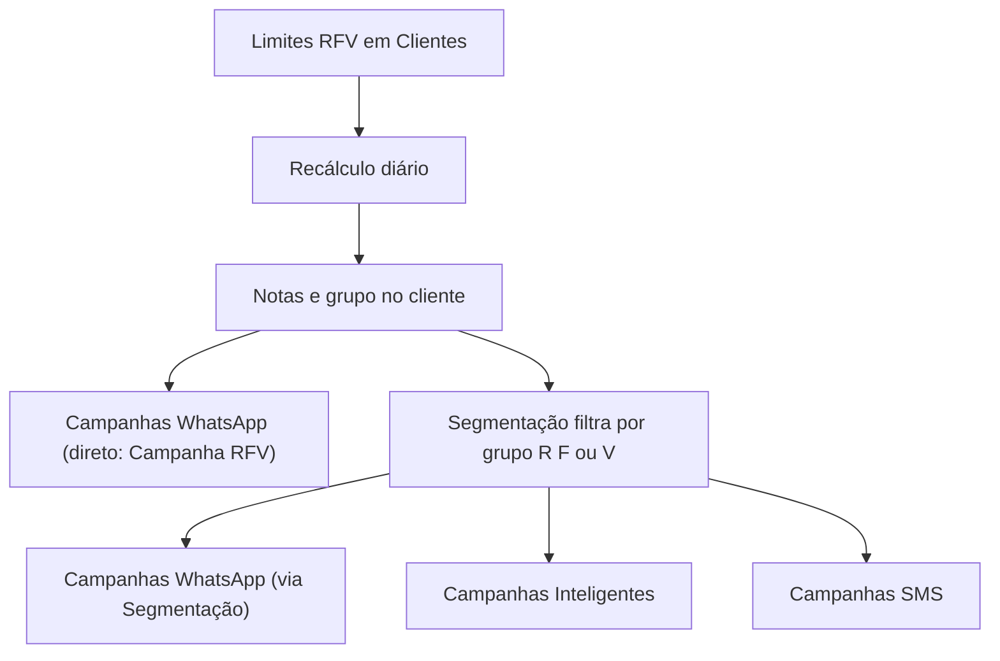

## Classificação automática de clientes por RFV

O restaurante não tem um cliente só. Tem quem pediu ontem, quem some há três meses, quem gasta pouco e aparece toda semana, quem gasta muito e sumiu.

**Mandar a mesma mensagem para todo mundo** custa três vezes:

- gasta crédito de WhatsApp e SMS com quem não ia responder
- queima o número: o Campeão de ontem recebe "sentimos sua falta" e bloqueia
- fala a coisa errada: o Perdido de 90 dias não precisa do lançamento VIP — precisa de um motivo para voltar

Por isso a BeeFood **segmenta**. Segmentar é recusar o disparo único. É olhar o comportamento de cada pessoa e decidir _quem_ entra na campanha e _o que_ ela lê. Sem isso, o Food Marketing vira megafone: alto, caro e fácil de ignorar.

A classificação RFV é o jeito **automático** de fazer isso. Você não escolhe o grupo na ficha do cliente e não precisa lembrar quem sumiu. Você configura os **limites** — e o sistema, todo dia, responde três perguntas e coloca cada pessoa num grupo. O resto do Food Marketing usa esse grupo para montar o público.

|                  | Pergunta                    | Em uma palavra                        |
| ---------------- | --------------------------- | ------------------------------------- |
| **R** Recência   | Quando foi o último pedido? | Ainda está perto — ou já esfriou?     |
| **F** Frequência | Quantas vezes pediu?        | É de casa — ou veio uma vez?          |
| **V** Valor      | Qual o ticket médio?        | Pede o combo — ou o item mais barato? |

Com essas três notas o sistema junta a base em **11 grupos** (Campeão, Fiel, Em risco, Perdido…). Esse grupo é o que a **segmentação** filtra. E a segmentação é o público das campanhas — WhatsApp, inteligente e SMS.

Na prática, o grupo muda o que a loja fala:

| Situação                       | Grupo                       | Tom da mensagem                                              | Onde mandar                                      |
| ------------------------------ | --------------------------- | ------------------------------------------------------------ | ------------------------------------------------ |
| Cliente bom que está esfriando | Em risco / Não posso perder | "Sua falta pesou" + oferta pessoal                           | WhatsApp direto ou inteligente (troca o público) |
| Quase ninguém volta            | Perdidos / Hibernando       | Reativação curta, um motivo para voltar                      | WhatsApp Campanha RFV ou SMS por segmentação     |
| Já é de casa                   | Campeões / Fiéis            | Lançamento, combo, programa — **nunca** "sentimos sua falta" | Segmentação + campanha de lançamento             |
| Primeira compra recente        | Novos / Promissores         | Boas-vindas, segundo pedido                                  | Inteligente Boas-vindas ou segmentação           |

Este manual explica:

1. O que são R, F e V e os 11 grupos
2. Como editar os limites (a única tela em que você mexe)
3. Onde a classificação aparece (lista e ficha)
4. **Onde o RFV é usado** — Campanhas WhatsApp, Segmentação de Cliente, Campanhas Inteligentes, Campanhas SMS e o relatório

O passo a passo de cada campanha e da segmentação já está nos manuais dessas telas. Aqui o assunto é o elo: **de onde o grupo nasce e para onde ele vai**.

<Callout kind="tip" collapsed="false">
  As imagens deste manual têm setas com números. Cada número no texto corresponde ao campo ou botão indicado na tela.
</Callout>

## Onde encontrar

Abra **Clientes** no menu lateral. A classificação RFV fica nessa área, e não em **Configuração → Parâmetros**.

<Image src="https://raw.githubusercontent.com/BeeFood-Sistema-para-Restaurantes/beefood-web-react-manual/main/manuais/classificacao-rfv/imagens-tratadas/01-menu-clientes.png" width="800" alt="Menu lateral do BeeFood com a opção Clientes destacada" caption="Menu: Clientes" />

| Nº | Campo        | O que faz                                                       |
| -: | ------------ | --------------------------------------------------------------- |
|  1 | **Clientes** | Abre a lista de clientes, onde você acessa a classificação RFV. |

## A lista de clientes

No topo da lista, o BeeFood mostra o botão **RFV**, o botão de ajuda e os chips dos grupos que têm clientes.

<Image src="https://raw.githubusercontent.com/BeeFood-Sistema-para-Restaurantes/beefood-web-react-manual/main/manuais/classificacao-rfv/imagens-tratadas/02-lista-rfv-chips.png" width="800" alt="Lista de clientes com o botão RFV, a ajuda e os chips de classificação" caption="Botão RFV, ajuda e chips" />

| Nº | Campo                         | O que faz                                                                  |
| -: | ----------------------------- | -------------------------------------------------------------------------- |
|  1 | **RFV**                       | Abre a tela para editar os limites das notas de 1 a 5.                     |
|  2 | **?**                         | Abre a explicação dos 11 grupos, organizados pelo cruzamento entre R e FV. |
|  3 | **Chips dos grupos**          | Filtram a lista pelos clientes de um grupo específico.                     |
|  4 | **Grupo na linha do cliente** | Mostra o grupo atual do cliente.                                           |

O chip só aparece quando pelo menos um cliente pertence ao grupo. Se nenhum cliente estiver classificado como Campeões, por exemplo, o chip de Campeões não aparece.

## O que o sistema mede

O RFV usa três notas, cada uma de 1 a 5. A nota 1 representa o nível mais baixo e a nota 5 representa o nível mais alto.

| Letra | Nome       | O que mede                                | Nota 5 significa                  |
| ----- | ---------- | ----------------------------------------- | --------------------------------- |
| **R** | Recência   | Quantidade de dias desde o último pedido. | O cliente comprou há pouco tempo. |
| **F** | Frequência | Quantidade de pedidos realizados.         | O cliente pediu muitas vezes.     |
| **V** | Valor      | Ticket médio dos pedidos.                 | O valor médio dos pedidos é alto. |

O sistema não cruza as três notas separadamente. Primeiro, calcula a média arredondada de **Frequência** e **Valor** para formar a nota **FV**. Depois, cruza **R × FV** para colocar o cliente em um dos 11 grupos.

## Os limites das notas

Clique em **RFV** na lista de clientes para abrir a tela de parâmetros. Essa é a única tela em que você altera os limites usados no cálculo.

<Image src="https://raw.githubusercontent.com/BeeFood-Sistema-para-Restaurantes/beefood-web-react-manual/main/manuais/classificacao-rfv/imagens-tratadas/03-parametros-rfv.png" width="800" alt="Tela de parâmetros RFV com os limites de Recência, Frequência e Valor" caption="Limites de Recência, Frequência e Valor" />

| Nº | Campo               | O que faz                                                           |
| -: | ------------------- | ------------------------------------------------------------------- |
|  1 | **Recência**        | Define quantos dias desde o último pedido correspondem a cada nota. |
|  2 | **Frequência**      | Define a quantidade de pedidos necessária para cada nota.           |
|  3 | **Valor monetário** | Define o ticket médio necessário para cada nota.                    |
|  4 | **Resetar Padrão**  | Restaura os limites padrão do BeeFood.                              |

Os valores padrão são:

| Nota | Recência         | Frequência             | Ticket médio           |
| ---: | ---------------- | ---------------------- | ---------------------- |
|    5 | Até 5 dias       | A partir de 12 pedidos | A partir de R$ 100,00  |
|    4 | De 6 a 16 dias   | De 9 a 11 pedidos      | De R$ 80,00 a R$ 99,99 |
|    3 | De 17 a 30 dias  | De 5 a 8 pedidos       | De R$ 50,00 a R$ 79,99 |
|    2 | De 31 a 48 dias  | De 2 a 4 pedidos       | De R$ 30,00 a R$ 49,99 |
|    1 | Acima de 49 dias | Até 1 pedido           | Até R$ 29,99           |

Quando você altera um limite, o limite vizinho se ajusta automaticamente para evitar intervalos sem classificação ou faixas sobrepostas.

<Callout kind="alert" collapsed="false">
  Depois de clicar em **Salvar**, a classificação não muda imediatamente. O sistema recalcula as notas e os grupos uma vez por dia. Aguarde até o dia seguinte para conferir o resultado na lista de clientes, na ficha e nas campanhas. Não existe um botão para recalcular agora.
</Callout>

## Os 11 grupos

Clique no botão **?** ao lado de **RFV** para consultar os grupos. Cada card mostra a faixa de Recência, a faixa de FV e uma sugestão de ação.

<Image src="https://raw.githubusercontent.com/BeeFood-Sistema-para-Restaurantes/beefood-web-react-manual/main/manuais/classificacao-rfv/imagens-tratadas/04-classificacoes.png" width="800" alt="Tela de ajuda com os grupos da classificação RFV e suas faixas de R e FV" caption="Ajuda dos grupos (R × FV)" />

| Nº | Campo             | O que faz                                                             |
| -: | ----------------- | --------------------------------------------------------------------- |
|  1 | **R**             | Indica a nota de Recência, de 1 a 5.                                  |
|  2 | **FV**            | Indica a média arredondada das notas de Frequência e Valor.           |
|  3 | **Card do grupo** | Mostra quais clientes entram no grupo e a ação sugerida pelo sistema. |

A lista completa dos grupos é:

| Grupo                                     |     R |    FV | Em uma frase                                               |
| ----------------------------------------- | ----: | ----: | ---------------------------------------------------------- |
| **Não posso perder**                      |     1 |     5 | Cliente de valor muito alto que deixou de comprar.         |
| **Em risco**                              | 1 a 2 | 3 a 5 | Cliente de bom valor que está se afastando.                |
| **Hibernando**                            |     2 |     2 | Cliente ausente que já fazia poucos pedidos.               |
| **Perdidos**                              | 1 a 2 | 1 a 2 | Cliente praticamente inativo.                              |
| **Precisam de atenção**                   |     3 |     3 | Cliente mediano que pode melhorar ou piorar.               |
| **Quase dormentes**                       |     3 | 1 a 2 | Cliente com recência média, poucos pedidos e ticket baixo. |
| **Campeões**                              |     5 |     5 | Cliente recente, frequente e de alto valor.                |
| **Fiéis**                                 | 3 a 5 | 4 a 5 | Cliente constante e de bom valor.                          |
| **Em potenciais** ou **Potenciais fiéis** | 4 a 5 | 2 a 3 | Cliente recente que ainda pode crescer.                    |
| **Promissores**                           |     4 |     1 | Cliente recente com pouco engajamento.                     |
| **Novos**                                 |     5 |     1 | Cliente que fez a primeira compra há pouco tempo.          |

**Em potenciais** e **Potenciais fiéis** representam o mesmo cruzamento de R e FV. A lista pode exibir qualquer um dos dois nomes.

Você não atribui um grupo manualmente. Se um cliente parece estar no grupo errado, revise os limites na tela **Clientes → RFV** e aguarde o próximo recálculo diário.

Quem ainda não tem histórico de pedido suficiente aparece como **Sem classificação**. Esse grupo também entra na campanha de WhatsApp, se você marcar.

## A ficha do cliente

Abra um cliente e acesse a aba **Indicadores** para consultar as notas e o grupo. Os dados são somente para leitura.

<Image src="https://raw.githubusercontent.com/BeeFood-Sistema-para-Restaurantes/beefood-web-react-manual/main/manuais/classificacao-rfv/imagens-tratadas/05-ficha-indicadores.png" width="800" alt="Aba Indicadores da ficha de cliente com o grupo e as notas de Recência, Frequência e Valor" caption="Ficha: notas só leitura, atualiza em 24h" />

| Nº | Campo                     | O que faz                                                  |
| -: | ------------------------- | ---------------------------------------------------------- |
|  1 | **Indicadores**           | Abre os indicadores RFV do cliente.                        |
|  2 | **Selo do grupo**         | Mostra o grupo calculado para o cliente.                   |
|  3 | **Atualizado a cada 24h** | Informa que as notas não são atualizadas em tempo real.    |
|  4 | **Recência**              | Mostra a nota calculada a partir da data do último pedido. |
|  5 | **Frequência**            | Mostra a nota calculada a partir da quantidade de pedidos. |
|  6 | **Valor**                 | Mostra a nota calculada a partir do ticket médio.          |

O círculo de Valor pode exibir o rótulo **Total gasto**, mas a nota usa o **ticket médio** configurado na tela de parâmetros. O total gasto e o ticket médio são métricas diferentes. Um cliente pode ter gasto muito ao longo do tempo e ainda receber uma nota baixa de Valor se o valor médio de cada pedido for baixo.

## Onde o RFV é usado

O grupo gravado no cliente alimenta o Food Marketing de **dois jeitos**. O WhatsApp lê o grupo direto. Segmentação, campanha inteligente e SMS leem o grupo **só se você filtrar por ele** num público salvo.

| Onde                              | Como o RFV entra                                                                                   |
| --------------------------------- | -------------------------------------------------------------------------------------------------- |
| **Clientes**                      | Ver, filtrar pelos chips, exportar Excel; editar os limites                                        |
| **Segmentação de Cliente**        | Quatro filtros: grupo, Recência, Frequência, Valor. O modelo **Clientes VIP** já usa F 4–5 e V 4–5 |
| **Campanhas WhatsApp**            | **Direto** (escolhe o grupo) **ou** via uma segmentação                                            |
| **Campanhas Inteligentes**        | **Só** via segmentação (campo _Origem do público_)                                                 |
| **Campanhas SMS**                 | **Só** via segmentação (passo 2, _Por segmentação_)                                                |
| **Desempenho → Análise RFV**      | Só leitura: o mesmo grupo em gráfico e Excel                                                       |
| **Desempenho → Base de Clientes** | Gráfico da mesma classificação, no meio dos outros recortes da base                                |

<Callout kind="tip" collapsed="false">
  A regra prática:

  - Precisa só do grupo (todos os Perdidos, todos os Fiéis) → **Campanha RFV** no WhatsApp, ou o filtro da segmentação.
  - Precisa misturar RFV com outra coisa (Perdidos **e** bairro X, Fiéis **que** têm cashback) → crie a **segmentação** e use ela no WhatsApp, na inteligente ou no SMS.
</Callout>

Cupom, cashback, PDV e Pixel **não** leem o grupo RFV. Quem entra nessas telas entra por outra regra (produto, saldo, evento). O RFV mora no cadastro do cliente e no Food Marketing.

### 1. Segmentação de Cliente

Acesse **Food Marketing → Segmentação de Cliente** e selecione a categoria **RFV** ao criar ou editar um público.

<Image src="https://raw.githubusercontent.com/BeeFood-Sistema-para-Restaurantes/beefood-web-react-manual/main/manuais/classificacao-rfv/imagens-tratadas/06-segmentacao-rfv.png" width="800" alt="Categoria RFV na tela de criação de uma segmentação de clientes" caption="Categoria RFV na segmentação" />

| Nº | Campo                            | O que faz                                                     |
| -: | -------------------------------- | ------------------------------------------------------------- |
|  1 | **Categoria RFV**                | Exibe os filtros relacionados à classificação RFV.            |
|  2 | **Classificação RFV**            | Filtra por grupo, como Campeões, Fiéis, Em risco ou Perdidos. |
|  3 | **Recência, Frequência e Valor** | Permite filtrar diretamente pelas notas de 1 a 5.             |

Uma segmentação **Ativa** fica disponível para as três campanhas abaixo. Se o botão Ativa estiver desligado, o público continua salvo, mas some da hora de montar campanha.

O modelo pronto **Clientes VIP (alto valor)** já nasce com Frequência 4 ou 5 **e** Valor 4 ou 5, ou seja, já é RFV, sem você montar do zero. Os outros modelos (sumidos, 2ª compra, cashback) usam indicadores, não o grupo. Se a ideia for "todos os Perdidos" ou "Em risco + Hibernando", crie a segmentação pelo filtro **Classificação RFV**.

O passo a passo (E/OU, testar o tamanho, modelos prontos) está no manual de [Segmentação de Clientes](/segmentacao-clientes).

### 2. Campanhas WhatsApp: dois caminhos

Em **Food Marketing → Campanhas WhatsApp**, aba **Campanhas**, o botão **Nova Campanha Filtro Avançado** abre três atalhos. Dois deles usam o RFV.

<Image src="https://raw.githubusercontent.com/BeeFood-Sistema-para-Restaurantes/beefood-web-react-manual/main/manuais/classificacao-rfv/imagens-tratadas/08-whatsapp-menu-rfv.png" width="800" alt="Atalhos de campanha no WhatsApp com Campanha RFV e Campanha Segmentação" caption="WhatsApp: Campanha RFV e Campanha Segmentação" />

| Nº | Campo                            | O que faz                                                                                                     |
| -: | -------------------------------- | ------------------------------------------------------------------------------------------------------------- |
|  1 | **Campanha RFV**                 | Escolhe o grupo na hora; o sistema monta a lista com quem está classificado assim.                            |
|  2 | **Campanha Segmentação Cliente** | Usa um público que você já salvou (e esse público _pode_ filtrar RFV, sozinho ou misturado com outro filtro). |

**Campanha RFV** abre a escolha das classificações:

<Image src="https://raw.githubusercontent.com/BeeFood-Sistema-para-Restaurantes/beefood-web-react-manual/main/manuais/classificacao-rfv/imagens-tratadas/09-whatsapp-campanha-rfv.png" width="800" alt="Nova Campanha RFV em Massa com os cards de cada classificação" caption="Nova Campanha RFV em Massa" />

| Nº | Campo                          | O que faz                                                                                                                      |
| -: | ------------------------------ | ------------------------------------------------------------------------------------------------------------------------------ |
|  1 | **Nova Campanha RFV em Massa** | Um disparo por grupo que você marcar.                                                                                          |
|  2 | **Cards das classificações**   | Cada classificação e quantos clientes tem agora. **Sem classificação** são os que ainda não caíram em grupo (pouco histórico). |
|  3 | **Avançar**                    | Segue para a mensagem. Não confirme se estiver só olhando.                                                                     |

Dentro de uma campanha já aberta existe o mesmo atalho: **Adicionar → RFV**, para completar a lista sem criar campanha nova.

### 3. Campanhas Inteligentes: pela segmentação

A campanha inteligente **não lê o grupo RFV direto**. No passo 1, a origem do público é **Segmentação de clientes**.

<Image src="https://raw.githubusercontent.com/BeeFood-Sistema-para-Restaurantes/beefood-web-react-manual/main/manuais/classificacao-rfv/imagens-tratadas/07-campanha-inteligente-segmentacao.png" width="800" alt="Configuração de campanha inteligente com Segmentação de clientes como origem do público" caption="Campanha inteligente: campo Segmentação" />

| Nº | Campo                 | O que faz                                                |
| -: | --------------------- | -------------------------------------------------------- |
|  1 | **Origem do público** | Define que a campanha usará uma segmentação de clientes. |
|  2 | **Segmentação**       | Define qual público a campanha deve avaliar diariamente. |

Quatro das seis campanhas padrão falam com um público: Recuperador de vendas, Cashback parado, Aniversário e Boas-vindas. Elas já vêm com um público da BeeFood (sumidos, cashback, aniversariantes, novos), **não** são filtro de classificação RFV. Troque o campo Segmentação por um público seu que filtre **Em risco** ou **Não posso perder**, se for isso que você quer.

Carrinho abandonado e "Recebeu o cardápio e não pediu" disparam por **evento**, não por segmentação: o RFV não entra.

O detalhe dos seis modelos está no manual de [Campanhas Inteligentes WhatsApp](/campanhas-inteligentes-whatsapp).

### 4. Campanhas SMS: pela segmentação

O SMS **também não tem atalho RFV**. No passo 2 dos destinatários, o caminho é **Por segmentação**.

<Image src="https://raw.githubusercontent.com/BeeFood-Sistema-para-Restaurantes/beefood-web-react-manual/main/manuais/classificacao-rfv/imagens-tratadas/10-sms-segmentacao.png" width="800" alt="SMS: destinatários por segmentação com seleção de público" caption="SMS: destinatários por segmentação" />

| Nº | Campo                                    | O que faz                                                                                                                                                                         |
| -: | ---------------------------------------- | --------------------------------------------------------------------------------------------------------------------------------------------------------------------------------- |
|  1 | **Por segmentação**                      | O modo que usa o público salvo.                                                                                                                                                   |
|  2 | **Selecione um público** + **ADICIONAR** | Só entram segmentações **Ativas**. Se essa segmentação filtrar RFV, o SMS fala com esse grupo. A segmentação já traz só cliente com telefone válido, ativo e que aceita mensagem. |

Os outros dois modos (telefone avulso e planilha) não passam pelo RFV. Créditos, UCS-2 e blacklist estão no manual de [Campanhas SMS](/campanhas-sms).

### Relatório e Excel

Em **Desempenho → Clientes → Análise RFV** o sistema mostra a mesma classificação em gráfico e deixa baixar Excel. Não se edita limite por lá, só se lê o resultado.

A mesma classificação aparece de novo em **Desempenho → Clientes → Base de Clientes**, no gráfico _Classificação RFV_, no meio dos outros recortes da base (origem, canal, ticket).

A exportação Excel da lista de **Clientes** e a da **segmentação** também trazem a coluna Classificação.

## O que lembrar

- O BeeFood segmenta para a loja **não falar a mesma coisa com todo mundo**.
- O grupo é **calculado**. Não se marca Campeão na ficha.
- Você edita só os **limites** das notas 1 a 5, em **Clientes → RFV**.
- Depois de salvar, espere o recálculo do **dia seguinte**.
- **WhatsApp** usa RFV de dois jeitos: direto (**Campanha RFV**) ou via segmentação.
- **Campanha inteligente** e **SMS** usam RFV **só pela segmentação**.
- Cupom, cashback, PDV e Pixel **não** leem o grupo.
- O mesmo grupo aparece em **Desempenho → Análise RFV** e em **Base de Clientes** — só leitura.
- Segmentação, WhatsApp, inteligente e SMS já têm manual próprio; aqui o assunto é o elo.

## Perguntas frequentes

<ExpandableGroup>
  <Expandable title="Posso escolher ou editar o grupo de um cliente?" default-open="false">
    Não. O grupo é calculado automaticamente a partir das notas de Recência, Frequência e Valor. A ficha do cliente mostra essas informações somente para leitura.

    Se a classificação não corresponder ao resultado esperado, revise os limites em **Clientes → RFV** e aguarde o recálculo diário.
  </Expandable>

  <Expandable title="Por que o grupo não mudou logo depois que salvei os limites?" default-open="false">
    O BeeFood recalcula a classificação uma vez por dia. O salvamento dos limites não inicia um recálculo imediato, e não existe um botão para recalcular agora.

    Consulte a lista ou a ficha do cliente no dia seguinte para verificar as novas notas e o novo grupo.
  </Expandable>

  <Expandable title="O que a nota de Valor considera?" default-open="false">
    A nota de Valor considera o **ticket médio** dos pedidos, e não o total gasto pelo cliente ao longo do tempo.

    A ficha pode mostrar o rótulo **Total gasto** no círculo de Valor, mas o cálculo segue o ticket médio definido nos parâmetros RFV.
  </Expandable>

  <Expandable title="Por que um grupo não aparece como chip na lista?" default-open="false">
    Os chips aparecem apenas para grupos que têm pelo menos um cliente. Quando nenhum cliente pertence a um grupo, o chip desse grupo fica oculto.
  </Expandable>

  <Expandable title="A campanha inteligente usa o grupo RFV diretamente?" default-open="false">
    Não. A campanha inteligente lê uma segmentação de clientes. Para usar RFV, crie ou selecione uma segmentação que filtre por grupo, Recência, Frequência ou Valor e escolha essa segmentação como público da campanha.
  </Expandable>

  <Expandable title="As campanhas de carrinho abandonado usam RFV?" default-open="false">
    Não. Carrinho abandonado e **Recebeu o cardápio e não pediu** são campanhas acionadas por evento. Como não usam segmentação, o RFV não participa desses disparos.
  </Expandable>

  <Expandable title="O WhatsApp pode usar o grupo RFV direto, sem segmentação?" default-open="false">
    Sim. Em **Campanhas WhatsApp**, o atalho **Campanha RFV** deixa você escolher o grupo na hora. O sistema monta a lista com quem está classificado assim. Se precisar misturar RFV com outro filtro, use a segmentação.
  </Expandable>

  <Expandable title="O SMS tem um atalho RFV como o WhatsApp?" default-open="false">
    Não. O SMS só usa RFV por meio de uma segmentação. No passo 2 dos destinatários, escolha **Por segmentação** e selecione um público que filtre por grupo, Recência, Frequência ou Valor.
  </Expandable>

  <Expandable title="Quem são os clientes Sem classificação?" default-open="false">
    São clientes que ainda não têm histórico de pedidos suficiente para receber notas de R, F e V. Eles aparecem na lista sem chip e podem ser incluídos na **Campanha RFV** do WhatsApp, se você marcar o grupo **Sem classificação**.
  </Expandable>

  <Expandable title="Cupom e cashback usam o grupo RFV?" default-open="false">
    Não. Cupom, cashback, PDV e Pixel **não** leem a classificação RFV. Quem entra nessas telas entra por outra regra (produto, saldo, evento). O RFV mora no cadastro do cliente e no Food Marketing.
  </Expandable>
</ExpandableGroup>

## Manuais relacionados

<Columns cols="2">
  <Card title="Segmentação de Clientes" href="/segmentacao-clientes" icon="users" horizontal="false">
    Crie públicos usando classificação, Recência, Frequência e Valor.
  </Card>

  <Card title="Campanhas Inteligentes WhatsApp" href="/campanhas-inteligentes-whatsapp" icon="zap" horizontal="false">
    Use segmentações de clientes como público das campanhas inteligentes.
  </Card>

  <Card title="Campanhas SMS" href="/campanhas-sms" icon="cloud" horizontal="false">
    Envie SMS para públicos definidos por segmentação.
  </Card>

  <Card title="Gestão de fiado" href="/fiado" icon="book-open" horizontal="false">
    Consulte os recursos relacionados ao acompanhamento de clientes e pedidos fiados.
  </Card>
</Columns>

