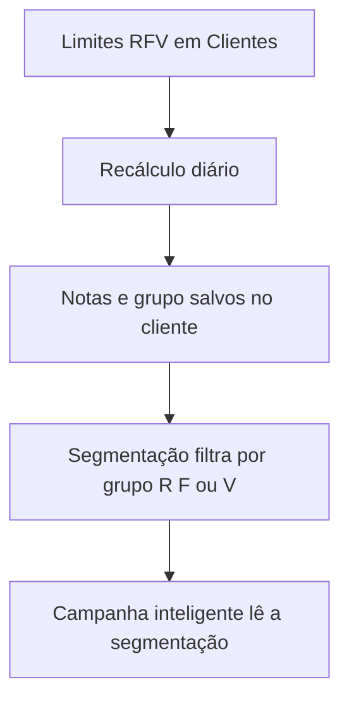

## Classificação automática de clientes por RFV

Entenda como o BeeFood classifica seus clientes, ajuste os limites das notas e use os grupos para criar públicos mais específicos em campanhas.

<Callout kind="tip" collapsed="false">
  As imagens deste manual têm setas com números. Cada número no texto corresponde ao campo ou botão indicado na tela.
</Callout>

<Callout kind="info" collapsed="false">
  O BeeFood classifica cada cliente automaticamente. Você não escolhe o grupo na ficha do cliente. Os grupos são definidos pelas notas de Recência, Frequência e Valor e pelos limites configurados em **Clientes → RFV**.
</Callout>

## Onde encontrar

Abra **Clientes** no menu lateral. A classificação RFV fica nessa área, e não em **Configuração → Parâmetros**.

<Image src="https://raw.githubusercontent.com/BeeFood-Sistema-para-Restaurantes/beefood-web-react-manual/main/manuais/classificacao-rfv/imagens-tratadas/01-menu-clientes.png" width="800" alt="Menu lateral do BeeFood com a opção Clientes destacada" caption="Menu: Clientes" />

| Nº | Campo        | O que faz                                                       |
| -: | ------------ | --------------------------------------------------------------- |
|  1 | **Clientes** | Abre a lista de clientes, onde você acessa a classificação RFV. |

## A lista de clientes

No topo da lista, o BeeFood mostra o botão **RFV**, o botão de ajuda e os chips dos grupos que têm clientes.

<Image src="https://raw.githubusercontent.com/BeeFood-Sistema-para-Restaurantes/beefood-web-react-manual/main/manuais/classificacao-rfv/imagens-tratadas/02-lista-rfv-chips.png" width="800" alt="Lista de clientes com o botão RFV, a ajuda e os chips de classificação" caption="Botão RFV, ajuda e chips" />

| Nº | Campo                         | O que faz                                                                  |
| -: | ----------------------------- | -------------------------------------------------------------------------- |
|  1 | **RFV**                       | Abre a tela para editar os limites das notas de 1 a 5.                     |
|  2 | **?**                         | Abre a explicação dos 11 grupos, organizados pelo cruzamento entre R e FV. |
|  3 | **Chips dos grupos**          | Filtram a lista pelos clientes de um grupo específico.                     |
|  4 | **Grupo na linha do cliente** | Mostra o grupo atual do cliente.                                           |

O chip só aparece quando pelo menos um cliente pertence ao grupo. Se nenhum cliente estiver classificado como Campeões, por exemplo, o chip de Campeões não aparece.

## O que o sistema mede

O RFV usa três notas, cada uma de 1 a 5. A nota 1 representa o nível mais baixo e a nota 5 representa o nível mais alto.

| Letra | Nome       | O que mede                                | Nota 5 significa                  |
| ----- | ---------- | ----------------------------------------- | --------------------------------- |
| **R** | Recência   | Quantidade de dias desde o último pedido. | O cliente comprou há pouco tempo. |
| **F** | Frequência | Quantidade de pedidos realizados.         | O cliente pediu muitas vezes.     |
| **V** | Valor      | Ticket médio dos pedidos.                 | O valor médio dos pedidos é alto. |

O sistema não cruza as três notas separadamente. Primeiro, calcula a média arredondada de **Frequência** e **Valor** para formar a nota **FV**. Depois, cruza **R × FV** para colocar o cliente em um dos 11 grupos.

## Os limites das notas

Clique em **RFV** na lista de clientes para abrir a tela de parâmetros. Essa é a única tela em que você altera os limites usados no cálculo.

<Image src="https://raw.githubusercontent.com/BeeFood-Sistema-para-Restaurantes/beefood-web-react-manual/main/manuais/classificacao-rfv/imagens-tratadas/03-parametros-rfv.png" width="800" alt="Tela de parâmetros RFV com os limites de Recência, Frequência e Valor" caption="Limites de Recência, Frequência e Valor" />

| Nº | Campo               | O que faz                                                           |
| -: | ------------------- | ------------------------------------------------------------------- |
|  1 | **Recência**        | Define quantos dias desde o último pedido correspondem a cada nota. |
|  2 | **Frequência**      | Define a quantidade de pedidos necessária para cada nota.           |
|  3 | **Valor monetário** | Define o ticket médio necessário para cada nota.                    |
|  4 | **Resetar Padrão**  | Restaura os limites padrão do BeeFood.                              |

Os valores padrão são:

| Nota | Recência         | Frequência             | Ticket médio           |
| ---: | ---------------- | ---------------------- | ---------------------- |
|    5 | Até 5 dias       | A partir de 12 pedidos | A partir de R$ 100,00  |
|    4 | De 6 a 16 dias   | De 9 a 11 pedidos      | De R$ 80,00 a R$ 99,99 |
|    3 | De 17 a 30 dias  | De 5 a 8 pedidos       | De R$ 50,00 a R$ 79,99 |
|    2 | De 31 a 48 dias  | De 2 a 4 pedidos       | De R$ 30,00 a R$ 49,99 |
|    1 | Acima de 49 dias | Até 1 pedido           | Até R$ 29,99           |

Quando você altera um limite, o limite vizinho se ajusta automaticamente para evitar intervalos sem classificação ou faixas sobrepostas.

<Callout kind="alert" collapsed="false">
  Depois de clicar em **Salvar**, a classificação não muda imediatamente. O sistema recalcula as notas e os grupos uma vez por dia. Aguarde até o dia seguinte para conferir o resultado na lista de clientes, na ficha e nas campanhas. Não existe um botão para recalcular agora.
</Callout>

## Os 11 grupos

Clique no botão **?** ao lado de **RFV** para consultar os grupos. Cada card mostra a faixa de Recência, a faixa de FV e uma sugestão de ação.

<Image src="https://raw.githubusercontent.com/BeeFood-Sistema-para-Restaurantes/beefood-web-react-manual/main/manuais/classificacao-rfv/imagens-tratadas/04-classificacoes.png" width="800" alt="Tela de ajuda com os grupos da classificação RFV e suas faixas de R e FV" caption="Ajuda dos grupos (R × FV)" />

| Nº | Campo             | O que faz                                                             |
| -: | ----------------- | --------------------------------------------------------------------- |
|  1 | **R**             | Indica a nota de Recência, de 1 a 5.                                  |
|  2 | **FV**            | Indica a média arredondada das notas de Frequência e Valor.           |
|  3 | **Card do grupo** | Mostra quais clientes entram no grupo e a ação sugerida pelo sistema. |

A lista completa dos grupos é:

| Grupo                                     |     R |    FV | Em uma frase                                               |
| ----------------------------------------- | ----: | ----: | ---------------------------------------------------------- |
| **Não posso perder**                      |     1 |     5 | Cliente de valor muito alto que deixou de comprar.         |
| **Em risco**                              | 1 a 2 | 3 a 5 | Cliente de bom valor que está se afastando.                |
| **Hibernando**                            |     2 |     2 | Cliente ausente que já fazia poucos pedidos.               |
| **Perdidos**                              | 1 a 2 | 1 a 2 | Cliente praticamente inativo.                              |
| **Precisam de atenção**                   |     3 |     3 | Cliente mediano que pode melhorar ou piorar.               |
| **Quase dormentes**                       |     3 | 1 a 2 | Cliente com recência média, poucos pedidos e ticket baixo. |
| **Campeões**                              |     5 |     5 | Cliente recente, frequente e de alto valor.                |
| **Fiéis**                                 | 3 a 5 | 4 a 5 | Cliente constante e de bom valor.                          |
| **Em potenciais** ou **Potenciais fiéis** | 4 a 5 | 2 a 3 | Cliente recente que ainda pode crescer.                    |
| **Promissores**                           |     4 |     1 | Cliente recente com pouco engajamento.                     |
| **Novos**                                 |     5 |     1 | Cliente que fez a primeira compra há pouco tempo.          |

**Em potenciais** e **Potenciais fiéis** representam o mesmo cruzamento de R e FV. A lista pode exibir qualquer um dos dois nomes.

Você não atribui um grupo manualmente. Se um cliente parece estar no grupo errado, revise os limites na tela **Clientes → RFV** e aguarde o próximo recálculo diário.

## A ficha do cliente

Abra um cliente e acesse a aba **Indicadores** para consultar as notas e o grupo. Os dados são somente para leitura.

<Image src="https://raw.githubusercontent.com/BeeFood-Sistema-para-Restaurantes/beefood-web-react-manual/main/manuais/classificacao-rfv/imagens-tratadas/05-ficha-indicadores.png" width="800" alt="Aba Indicadores da ficha de cliente com o grupo e as notas de Recência, Frequência e Valor" caption="Ficha: notas só leitura, atualiza em 24h" />

| Nº | Campo                     | O que faz                                                  |
| -: | ------------------------- | ---------------------------------------------------------- |
|  1 | **Indicadores**           | Abre os indicadores RFV do cliente.                        |
|  2 | **Selo do grupo**         | Mostra o grupo calculado para o cliente.                   |
|  3 | **Atualizado a cada 24h** | Informa que as notas não são atualizadas em tempo real.    |
|  4 | **Recência**              | Mostra a nota calculada a partir da data do último pedido. |
|  5 | **Frequência**            | Mostra a nota calculada a partir da quantidade de pedidos. |
|  6 | **Valor**                 | Mostra a nota calculada a partir do ticket médio.          |

O círculo de Valor pode exibir o rótulo **Total gasto**, mas a nota usa o **ticket médio** configurado na tela de parâmetros. O total gasto e o ticket médio são métricas diferentes. Um cliente pode ter gasto muito ao longo do tempo e ainda receber uma nota baixa de Valor se o valor médio de cada pedido for baixo.

## De onde a campanha pega o RFV

A campanha inteligente não consulta a classificação RFV diretamente. O fluxo passa pela segmentação:

A segmentação pode filtrar o cliente pelo grupo completo, pela nota de Recência, pela nota de Frequência ou pela nota de Valor.

### Na segmentação

Acesse **Food Marketing → Segmentação de Cliente** e selecione a categoria **RFV** ao criar ou editar um público.

<Image src="https://raw.githubusercontent.com/BeeFood-Sistema-para-Restaurantes/beefood-web-react-manual/main/manuais/classificacao-rfv/imagens-tratadas/06-segmentacao-rfv.png" width="800" alt="Categoria RFV na tela de criação de uma segmentação de clientes" caption="Categoria RFV na segmentação" />

| Nº | Campo                            | O que faz                                                     |
| -: | -------------------------------- | ------------------------------------------------------------- |
|  1 | **Categoria RFV**                | Exibe os filtros relacionados à classificação RFV.            |
|  2 | **Classificação RFV**            | Filtra por grupo, como Campeões, Fiéis, Em risco ou Perdidos. |
|  3 | **Recência, Frequência e Valor** | Permite filtrar diretamente pelas notas de 1 a 5.             |

O manual de [Segmentação de Clientes](/segmentacao-clientes) explica como criar o público, testar o tamanho e combinar filtros com as regras **E** e **OU**.

### Na campanha inteligente

Quatro das seis campanhas inteligentes padrão usam um público de clientes:

- **Recuperador de vendas**
- **Cashback parado**
- **Aniversário**
- **Boas-vindas**

No primeiro passo da campanha, selecione **Segmentação de clientes** como origem do público.

<Image src="https://raw.githubusercontent.com/BeeFood-Sistema-para-Restaurantes/beefood-web-react-manual/main/manuais/classificacao-rfv/imagens-tratadas/07-campanha-inteligente-segmentacao.png" width="800" alt="Configuração de campanha inteligente com Segmentação de clientes como origem do público" caption="Campanha inteligente: campo Segmentação" />

| Nº | Campo                 | O que faz                                                |
| -: | --------------------- | -------------------------------------------------------- |
|  1 | **Origem do público** | Define que a campanha usará uma segmentação de clientes. |
|  2 | **Segmentação**       | Define qual público a campanha deve avaliar diariamente. |

As campanhas padrão já vêm com públicos definidos pelo BeeFood, como clientes sumidos, aniversariantes, clientes com cashback e clientes novos. Você pode trocar o público padrão por uma segmentação criada por você que filtre RFV, como um público com clientes **Em risco** ou **Não posso perder**.

As campanhas de **Carrinho abandonado** e **Recebeu o cardápio e não pediu** são acionadas por eventos. Como não usam segmentação, a classificação RFV não se aplica a elas.

Consulte [Campanhas Inteligentes WhatsApp](/campanhas-inteligentes-whatsapp) para configurar os modelos, públicos e regras de envio.

## Relatório

Acesse **Desempenho → Clientes → Análise RFV** para visualizar a mesma classificação em formato de gráfico. O relatório é somente para consulta. Para alterar os resultados, edite os limites em **Clientes → RFV**.

## O que lembrar

- O BeeFood calcula o grupo automaticamente. Você não atribui Campeão, Fiéis ou Perdidos na ficha.
- R mede os dias desde o último pedido.
- F mede a quantidade de pedidos.
- V usa o ticket médio, mesmo que o círculo da ficha mostre o rótulo **Total gasto**.
- F e V formam a nota FV pela média arredondada.
- Você edita apenas os limites das notas em **Clientes → RFV**.
- O limite vizinho se ajusta automaticamente para evitar intervalos e sobreposições.
- Depois de salvar, aguarde o recálculo do dia seguinte.
- Os chips da lista só aparecem para grupos que têm pelo menos um cliente.
- A campanha inteligente usa RFV por meio da segmentação, e não diretamente.

## Perguntas frequentes

<ExpandableGroup>
  <Expandable title="Posso escolher ou editar o grupo de um cliente?" default-open="false">
    Não. O grupo é calculado automaticamente a partir das notas de Recência, Frequência e Valor. A ficha do cliente mostra essas informações somente para leitura.

    Se a classificação não corresponder ao resultado esperado, revise os limites em **Clientes → RFV** e aguarde o recálculo diário.
  </Expandable>

  <Expandable title="Por que o grupo não mudou logo depois que salvei os limites?" default-open="false">
    O BeeFood recalcula a classificação uma vez por dia. O salvamento dos limites não inicia um recálculo imediato, e não existe um botão para recalcular agora.

    Consulte a lista ou a ficha do cliente no dia seguinte para verificar as novas notas e o novo grupo.
  </Expandable>

  <Expandable title="O que a nota de Valor considera?" default-open="false">
    A nota de Valor considera o **ticket médio** dos pedidos, e não o total gasto pelo cliente ao longo do tempo.

    A ficha pode mostrar o rótulo **Total gasto** no círculo de Valor, mas o cálculo segue o ticket médio definido nos parâmetros RFV.
  </Expandable>

  <Expandable title="Por que um grupo não aparece como chip na lista?" default-open="false">
    Os chips aparecem apenas para grupos que têm pelo menos um cliente. Quando nenhum cliente pertence a um grupo, o chip desse grupo fica oculto.
  </Expandable>

  <Expandable title="A campanha inteligente usa o grupo RFV diretamente?" default-open="false">
    Não. A campanha inteligente lê uma segmentação de clientes. Para usar RFV, crie ou selecione uma segmentação que filtre por grupo, Recência, Frequência ou Valor e escolha essa segmentação como público da campanha.
  </Expandable>

  <Expandable title="As campanhas de carrinho abandonado usam RFV?" default-open="false">
    Não. Carrinho abandonado e **Recebeu o cardápio e não pediu** são campanhas acionadas por evento. Como não usam segmentação, o RFV não participa desses disparos.
  </Expandable>
</ExpandableGroup>

## Manuais relacionados

<Columns cols="2">
  <Card title="Segmentação de Clientes" href="/segmentacao-clientes" icon="users" horizontal="false">
    Crie públicos usando classificação, Recência, Frequência e Valor.
  </Card>

  <Card title="Campanhas Inteligentes WhatsApp" href="/campanhas-inteligentes-whatsapp" icon="zap" horizontal="false">
    Use segmentações de clientes como público das campanhas inteligentes.
  </Card>

  <Card title="Campanhas SMS" href="/campanhas-sms" icon="cloud" horizontal="false">
    Envie SMS para públicos definidos por segmentação.
  </Card>

  <Card title="Gestão de fiado" href="/fiado" icon="book-open" horizontal="false">
    Consulte os recursos relacionados ao acompanhamento de clientes e pedidos fiados.
  </Card>
</Columns>

