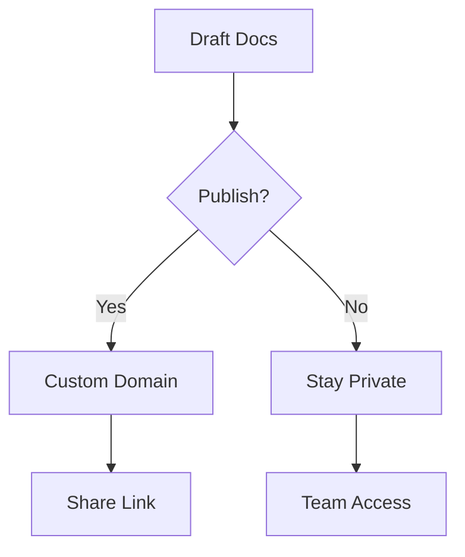

## Overview

BeeFood provides powerful tools for managing your project documentation. You can organize content into folders, collaborate with teams in real-time, track changes with version control, and publish docs effortlessly. These core features streamline your workflow from creation to sharing.

<Columns cols={2}>
  <Card title="Document Folders" icon="folder" href="#document-organization">
    Structure your docs hierarchically for easy navigation.
  </Card>
  <Card title="Team Collaboration" icon="users" href="#collaboration">
    Work together with real-time editing and comments.
  </Card>
  <Card title="Version Control" icon="git-branch" href="#version-control">
    Track changes and revert to previous versions.
  </Card>
  <Card title="Publishing Options" icon="globe" href="#publishing">
    Share docs publicly or privately with custom domains.
  </Card>
</Columns>

## Document Organization and Folders

Organize your documentation into intuitive folder structures. Create nested folders to group related pages, making it simple to find and manage content.

<Steps>
  <Step title="Create a Folder" icon="folder-plus">
    Navigate to your workspace and select the parent folder. Click `New Folder` and enter a name like `API Reference`.
  </Step>
  <Step title="Move Documents" icon="move">
    Drag and drop pages into folders or use the `Move` option in page settings.
  </Step>
  <Step title="Search Folders" icon="search">
    Use the global search to locate content across your folder tree.
  </Step>
</Steps>

<Callout kind="tip">
  Use descriptive folder names like `User Guides` or `Developer Docs` to improve team navigation.
</Callout>

## Collaboration Tools for Teams

BeeFood enables seamless teamwork with real-time editing, comments, and permissions.

<Tabs>
  <Tab title="Real-time Editing" icon="edit-3">
    Multiple users edit simultaneously. Changes appear instantly for all collaborators.
  </Tab>
  <Tab title="Comments & Mentions" icon="message-circle">
    Add inline comments with `@mentions` to notify team members.

````jsx
// Example comment notification
@john-doe Review the API endpoint description on line 15.
````

  </Tab>
  <Tab title="Permissions" icon="shield">
    Set read-only, edit, or admin access per folder or page.
  </Tab>
</Tabs>

## Version Control and Editing Capabilities

Maintain history with automatic versioning. Every edit creates a new version you can compare or restore.

<CodeGroup tabs="JavaScript,Python">
````javascript
// Fetch document versions via API
const response = await fetch('https://api.example.com/docs/{docId}/versions', {
  headers: { Authorization: `Bearer ${YOUR_API_KEY}` }
});
const versions = await response.json();
````

````python
import requests

response = requests.get(
    'https://api.example.com/docs/{docId}/versions',
    headers={'Authorization': f'Bearer {YOUR_API_KEY}'}
)
versions = response.json()
````
</CodeGroup>

<ParamField path="docId" param-type="string" required="true">
  Unique document identifier.
</ParamField>

<ParamField header="Authorization" param-type="string" required="true">
  Bearer token for authentication.
</ParamField>

## Publishing and Sharing Options

Publish your docs to custom URLs or share privately. Choose public, unlisted, or password-protected access.



<Expandable title="Advanced Publishing" default-open="false">

Configure webhooks for automated deployments:

````javascript
// Webhook payload example
{
  "event": "doc.published",
  "docId": "doc_123",
  "url": "https://docs.example.com/my-project"
}
````

</Expandable>

<Callout kind="success">
  Ready to try these features? Start with [Quickstart](/quickstart) for hands-on setup.
</Callout>