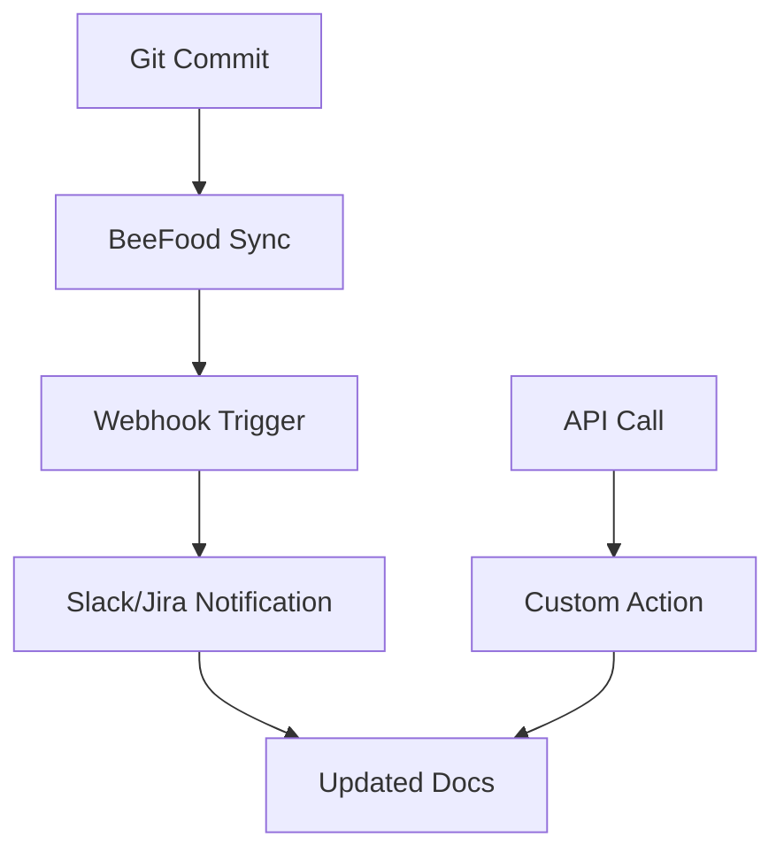

## Overview

BeeFood supports seamless integrations to automate your documentation workflows. Sync changes from your Git repository, connect with tools like Slack and Jira for notifications, set up webhooks for real-time updates, and use the API for custom solutions. These features help you maintain up-to-date docs without manual effort.

<Callout kind="tip">
Start with Git syncing for version control, then add webhooks for automation.
</Callout>

## Git Repository Syncing

Sync your BeeFood documentation with Git providers to automatically pull changes on commits or pulls.

<Steps>
  <Step title="Connect Repository" icon="git-branch">
    Navigate to the Integrations page in your BeeFood dashboard at `https://dashboard.example.com/integrations`.

    Select Git provider and authorize access.
  </Step>
  <Step title="Configure Sync" icon="settings">
    Specify the repository URL and branch (e.g., `main`).

    Choose sync triggers: push events or pull requests.
  </Step>
  <Step title="Test Sync" icon="play">
    Push a test commit to verify automatic updates in BeeFood.
  </Step>
</Steps>

## Third-Party App Connections

Connect BeeFood to popular tools for notifications and issue tracking.

<Columns cols={3}>
  <Card title="Slack" icon="message-circle" href="https://slack.com/apps" target="_blank">
    Receive deployment notifications and doc update alerts in your Slack channels.
  </Card>
  <Card title="Jira" icon="package" href="https://www.atlassian.com/software/jira" target="_blank">
    Link documentation changes to Jira tickets for better project traceability.
  </Card>
  <Card title="GitHub" icon="github" href="https://github.com/apps" target="_blank">
    Automate PR reviews and doc previews directly from GitHub.
  </Card>
</Columns>

## Webhook Setup

Webhooks enable real-time automation. Configure them to send events like doc publishes or user actions to your endpoint.

### Webhook Parameters

<ParamField path="event" param-type="string" required="true">
  Event type, such as `doc.published` or `doc.updated`.
</ParamField>

<ParamField header="X-BeeFood-Signature" param-type="string" required="false">
  HMAC signature for payload verification using your secret.
</ParamField>

### Example Payload

```json
{
  "event": "doc.published",
  "doc_id": "12345",
  "url": "https://docs.example.com/doc-12345",
  "timestamp": "2024-10-15T10:30:00Z"
}
```

Set up webhooks using these multi-language examples:

<CodeGroup tabs="cURL,JavaScript,Python">
  ```bash
  curl -X POST https://api.example.com/v1/webhooks \\
    -H "Authorization: Bearer YOUR_API_KEY" \\
    -H "Content-Type: application/json" \\
    -d '{
      "url": "https://your-webhook-url.com/webhook",
      "events": ["doc.published", "doc.updated"],
      "secret": "your-webhook-secret"
    }'
  ```
  ```javascript
  const response = await fetch('https://api.example.com/v1/webhooks', {
    method: 'POST',
    headers: {
      'Authorization': 'Bearer YOUR_API_KEY',
      'Content-Type': 'application/json'
    },
    body: JSON.stringify({
      url: 'https://your-webhook-url.com/webhook',
      events: ['doc.published', 'doc.updated'],
      secret: 'your-webhook-secret'
    })
  });
  ```
  ```python
  import requests

  data = {
    'url': 'https://your-webhook-url.com/webhook',
    'events': ['doc.published', 'doc.updated'],
    'secret': 'your-webhook-secret'
  }
  headers = {
    'Authorization': 'Bearer YOUR_API_KEY',
    'Content-Type': 'application/json'
  }
  response = requests.post('https://api.example.com/v1/webhooks', json=data, headers=headers)
  ```
</CodeGroup>

## Custom API Integrations

For advanced use cases, access the BeeFood API directly.

<Request tabs="JavaScript,cURL" show-lines="true">
  ```javascript
  const response = await fetch('https://api.example.com/v1/docs', {
    method: 'GET',
    headers: { 'Authorization': 'Bearer YOUR_API_KEY' }
  });
  const docs = await response.json();
  ```
  ```bash
  curl -X GET https://api.example.com/v1/docs \\
    -H "Authorization: Bearer YOUR_API_KEY"
  ```
</Request>

<Response tabs="200">
  ```json
  {
    "docs": [
      {
        "id": "12345",
        "title": "Getting Started",
        "slug": "getting-started",
        "updated_at": "2024-10-15T10:30:00Z"
      }
    ]
  }
  ```
</Response>

## Integration Workflow



<Callout kind="success">
Your integrations are now live. Monitor the Integrations dashboard for activity and errors.
</Callout>